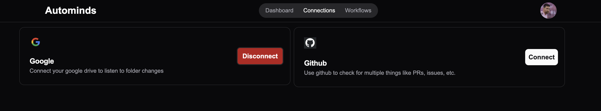
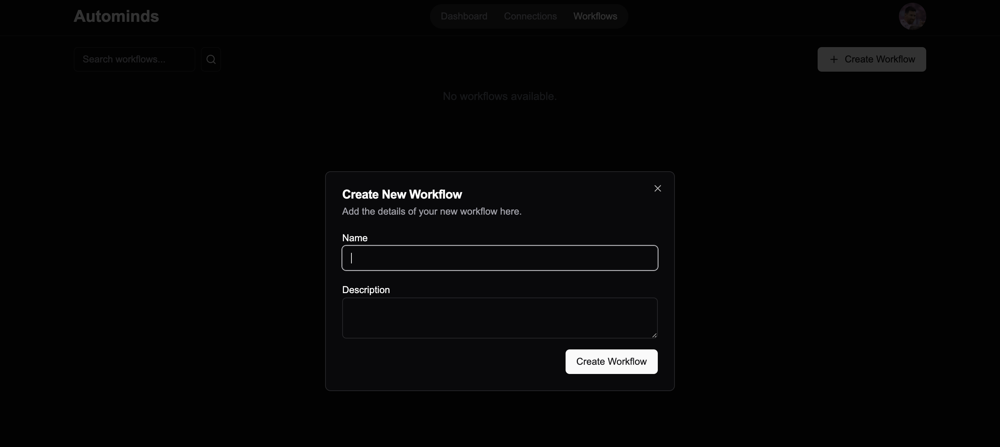
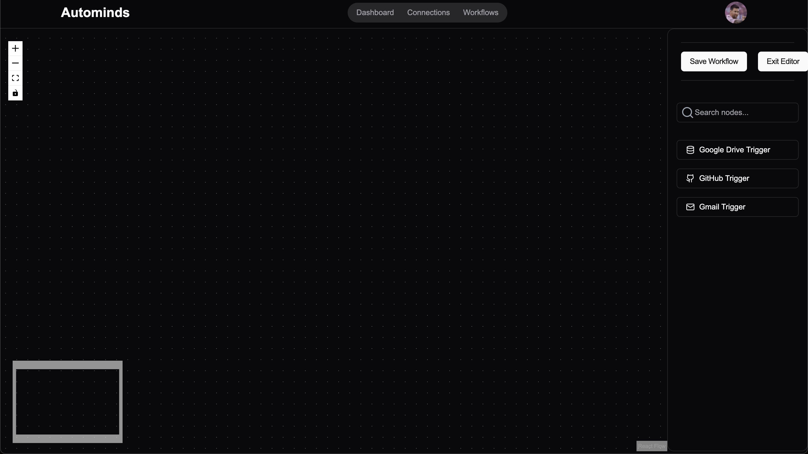

# AutoMinds

## 🌟 Overview

AutoMinds is a completely open-source platform that allows you to connect multiple user applications (such as Google Drive, Google Docs, Google Sheets, GitHub, Discord\* and many more) and automates workflows between them. AutoMinds lets you set up triggers and actions to streamline and automate repetitive tasks across different platforms.

🔗 See deployed website: [AutoMinds](https://auto-minds-six.vercel.app/)

## 📑 Table of Contents

- [✨ Features](#features)
- [📘 Steps](#steps)
- [🔧 Usage](#usage)
- [🔗 Supported Integrations](#supported-integrations)
- [⚙️ Workflow Setup](#workflow-setup)
- [📋 Todos & Upcoming Features](#todos--upcoming-features)
- [🤝 Contributing](#contributing)
- [📜 License](#license)

## ✨ [Features](/features.md)

- **Multi-App Connectivity**: Connect your Google Drive, Google Docs, Google Sheets, GitHub, Discord\*, and more. 📂
  

- **Automated Triggers**: Create triggers to automatically respond to specific events. For example:

  - When a Google Doc is created, a corresponding GitHub file can be auto-generated.
  - New CSV files added to GitHub can trigger Google Sheets entries.

- **Real-Time Updates**: Uses WebSocket for the `/workflow` page to reflect the latest updates. 🔄

- **Optimized State Management**: Uses Zustand for both `/workflow` and `/connection` pages to limit API calls, improving performance by storing and reusing data when possible. 📈

- **Customizable Actions**: Choose actions that fit your workflow, saving you time and eliminating repetitive tasks. ⏳

# 📘 Steps

- Steps to trigger:
  1. Connect all apps. 🔗
  2. Create Workflow. ⚙️
     
  3. Drag the trigger from the left side ➡️
     
  4. Connect the triggers. 🔄
     

## 🔧 Usage

1. **Connecting Apps**

   - Log into AutoMinds and link your desired apps (e.g., Google Apps, GitHub, Discord\*).

2. **Creating a Workflow**

   - Set up workflows with specific triggers and actions. For example:
     - **Trigger**: Google Docs creation 📄
     - **Action**: Auto-generate a corresponding GitHub file 📂

3. **Monitoring Automation**
   - View logs and notifications for each action taken by AutoMinds to keep track of your automations. 📊

## 🔗 Supported Integrations

- **Google Apps** (Docs, Sheets, Drive, etc.) 📄
- **GitHub** (Repository management, file creation, etc.) 💻
- **Discord\*** (Messaging, notifications, etc.) 💬  
  `*` Still Under-Devlopment (Note)

## ⚙️ Workflow Setup

### Google Drive Trigger Options

- **Google Drive as a Trigger**: Three options for interaction:
  - **Watch a File**: Select a specific file to monitor using a dropdown menu. 📂
  - **Create File in Folder**: Choose a target folder for file creation, allowing for deep folder selection. 📁
  - **Update File in Folder**: Track changes in a specified folder for automatic updates. 🔄

### State Management with Zustand

- **Optimized Data Calls**: For `/workflow` and `/connection` pages, Zustand stores data locally, reducing the need for multiple API calls on page load. This setup checks for updates in server data and syncs Zustand's store accordingly.

## 📋 Todos & Upcoming Features

- **Confirmation Prompts**: Alert users attempting to exit the workflow page without saving changes, including exits from:
  - The navbar, "Exit Editor" button, and window close.
- **Delete Node Feature**: Checks if node count from frontend is less than in the database, indicating node deletion. Implements backend validation using hash sets.
- **User Redirection**: Redirects users to `/signin` if not logged in or on authenticated pages unnecessarily.
- **Undo/Redo (CTRL+Z) Implementation**: Store full state in Zustand to enable undo/redo functionality, planned for future development.
- **Workflow States (Draft, Active, Inactive)**: Workflow status management including:
  - Publishing for active status, toggling with unpublish for inactive status.
  - Draft mode for editing and testing workflows.
- **Form Data Management**: Six forms need to handle data collection and backend integration:
  - In-memory array of node objects to prevent redundant fetches by storing fetched node info in-memory, ensuring data is requested from the backend only when not already retrieved.

## 🤝 Contributing

Contributions are welcome! To contribute:

1. Fork the repository.
2. Create a new branch for your feature or bug report.
3. Submit a pull request for review.

## 📜 License

- For license details, see [`License`](/LICENSE) file.

Readme